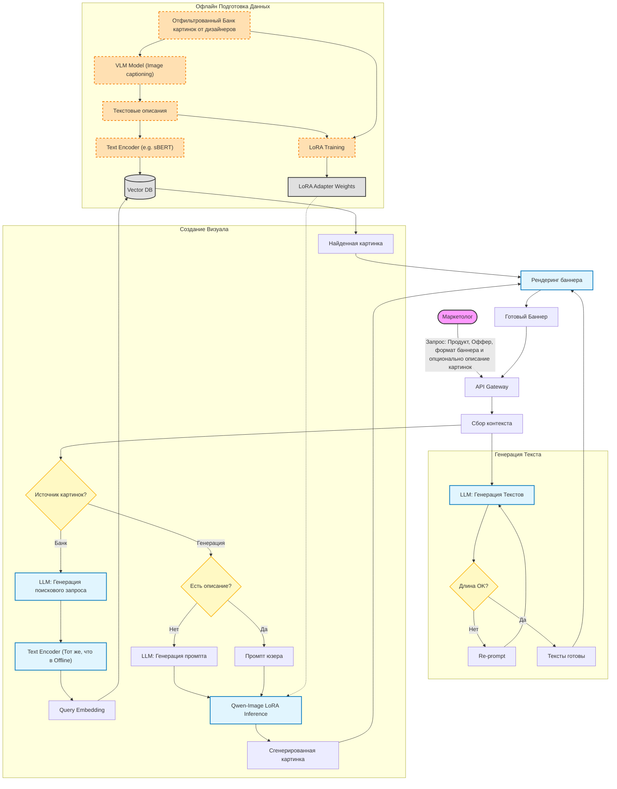
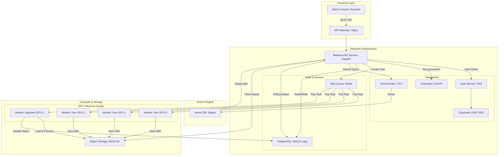

# ML System Design Doc - [RU]
## Дизайн ML системы - AdBanner GenAI System (MVP) 1.0

### 1. Цели и предпосылки
#### 1.1. Зачем идем в разработку продукта?

- **Контекст**: у компании, в которой я работаю, есть много различных продуктов/сервисов, которые нуждаются в рекламе. На данный момент работники компании (дизайнеры, маркетологи, копирайтеры) придумывают рекламные баннеры различных форматов, которые размещаются на разных сайтах и тем самым рекламируют продукты компании. Обычно на одном баннере присутствует текст (может быть просто текст одного размера и шрифта, а может быть заголовок + текст меньшего размера и т.д.) и картинки (от 0 до 5 картинок на одном баннере, все использумые картинки сделаны в определенном стиле компании). Чтобы удешевить процесс создания баннеров, была спроектирована данная система по автоматической генерации рекламных баннеров.
- **Бизнес-цель:** Существенно сократить Time-to-Market для запуска рекламных кампаний и снизить операционные расходы дизайнеров и копирайтеров. В условиях масштабирования количества продуктов компании ручное создание креативов становится bottleneck.
- **Почему станет лучше:** Сейчас процесс создания баннера занимает от 4 до 8 часов (брифинг -> копирайтинг -> дизайн -> согласование). Использование GenAI позволит сократить время "чернового" производства до 2 минут. Это освободит ресурсы команды для сложных, нестандартных задач, оставив подбор текстов и картинок для баннера алгоритмам.
- **Критерии успеха (Business Success Metrics):**
  - **Cost Reduction:** Снижение себестоимости генерации одного баннера на 80% по сравнению с ручным трудом.
  - **Adoption Rate:** 70% созданных системой баннеров используются в рекламных кампаниях с минимальными правками (или без них). "Минимальные правки" значит, что Levenshtein Distance между сгенерированным и финальным текстом < 20% от длины текста (метрика считается не по каждому текстовому полю в баннере, а по всем текстовым полям совмещённо), и каждая картинка из баннера была перегенерированна не более трёх раз.
  - **Quality:** созданные с помощью системы баннеры будут иметь CTR (Click-through rate) не ниже 0,9 * CTR баннеров, созданных людьми.

#### 1.2. Бизнес-требования и ограничения

- **Краткое описание БТ:** 
- Входные параметры (Inputs):
  - Продукт: Маркетолог выбирает из выпадающего списка (например, "Кредитная карта", "Доставка еды"). Маркетолог выбирает продукт, который он хочет прорекламировать на баннере.
  - Оффер: Поле для свободного ввода текста (например, "Кэшбэк 10% на все покупки до конца месяца"). Это основа для генерации контента.
  - Формат баннера: Выбор из пресетов (например, "Square 1080x1080", "Story 1080x1920"). Каждый формат жестко задает размеры, количество текстовых полей и их лимиты (в символах), а также количество и расположение картинок.
  - Режим: "Генерация AI" или "Поиск в базе" для генерации/поиска картинок для баннере.
  - Промпты для картинок (Optional): Для каждой картинки в шаблоне пользователь может ввести описание ("Счастливая семья ест пиццу"). Если поле пустое, система должна сама придумать описание на основе Оффера.
- Функциональные требования:
  - Генерация текста: Система должна разбить оффер на компоненты (их кол-во и смысл зависят от формата баннера, например: Заголовок, Основной текст, Кнопка) и переписать их так, чтобы они строго укладывались в лимиты символов выбранного формата.
  - Генерация изображений: Используется open-source модель. Генерация должна проходить в едином фирменном стиле компании (цветовая гамма, материалы, стиль иллюстраций), независимо от того, что изображено.
  - Поиск изображений: Если выбран режим "Поиск", система должна найти в базе картинок, предоставленной дизайнерами, наиболее подходящее изображение по смыслу оффера или описанию пользователя, если оно указано.
  - Рендеринг: Текст и картинки должны быть собраны в итоговый файл (PNG/JPG) автоматически. Текст не должен наезжать на картинки, читаемость должна быть сохранена.
- **Бизнес-ограничения:**
  - Время генерации < 2 минут на один баннер.
  - Для генерации текста обязательно надо использовать определенную развернутую на серверах компании LLM.
  - Генерация не должна содержать оскорбительного контента или артефактов, портящих имидж компании (фильтрация NSFW, соблюдение tone-of-voice).
  - Строгое соблюдение лимитов символов (текст не должен вылезать за рамки).
  - На этапе инференса (поиска) запрещено использовать любые Image Encoders (модели, принимающие на вход картинку), так как на продовых серверах уже развернут текстовый энкодер и надо использовать его. Поиск должен осуществляться только через текстовые эмбеддинги.
  - В распоряжении есть только 4 Nvidia H100 80GB видеокарты.
- **Сценарий использования (User Flow):**
  1. Маркетолог заходит в веб-интерфейс.
  2. Выбирает продукт (например, "Сервис доставки") и формат баннера.
  3. Вводит оффер: "Скидка 15% на первый заказ".
  4. (Опционально) Выбирает источник картинок: "Сток компании" или "AI Генерация".
  5. Нажимает "Генерировать".
  6. Через 1-2 минуты получает готовый макет. Может скачать его или нажать "Регенерировать".
- **Критерии успешного пилота:**
  - Проведено 20 реальных рекламных кампаний с использованием сгенерированных баннеров.
  - CTR сгенерированных баннеров не ниже 90% от CTR созданных вручную.

#### 1.3. Что входит в скоуп проекта/итерации, что не входит

- **Входит (In Scope):**
  - Разработка Pipeline генерации текстов на основе разрешенной для использования LLM.
  - Разработка модуля генерации изображений с дообучением open-source text to image диффузионной модели с помощью LoRA для соблюдения корпоративного стиля.
  - Разработка модуля поиска изображений (Image Retrieval) по базе картинок от дизайнеров (предварительно картинки в базе надо отфильтровать и оставить тольтко качественные).
  - Модуль рендеринга (композитинг текста и графики на подложке).
  - Система валидации длины текста.
  - API сервис.
- **Не входит (Out of Scope):**
  - Автоматическая публикация баннеров на рекламные площадки.
  - Сбор аналитики CTR внутри данного инструмента (аналитика собирается во внешних системах).
  - Real-time генерация баннера "на лету" под конретного пользователя — система работает только в режиме "offline/on-demand" для маркетолога.
- **Технический долг:**
  - В MVP конфигурация шаблонов (координаты полей) будет храниться в JSON-файлах, визуальный редактор шаблонов не предусмотрен.
  - Ограниченный набор LoRA-адаптеров для стилизации (только общий корпоративный стиль, без специфики под каждый суб-продукт).

#### 1.4. Предпосылки решения

*   **Данные:**
    *   **Банк изображений (~900 шт.):** На этапе подготовки данных (Offline) все изображения были прогнаны через VLM для получения подробных текстовых описаний. Векторная база содержит эмбеддинги *этих текстовых описаний*, а не самих картинок.
    *   **Датасет для обучения:** Набор из ~900 эталонных дизайнерских изображений для обучения LoRA-адаптера.
    *   **Конфиги форматов:** JSON-файлы с координатами и лимитами.
*   **Стек технологий:**
    *   **LLM:** разрешенная для использования LLM (для генерации текстов баннера и поисковых запросов).
    *   **Image Gen:** Open-source модель (Qwen-Image) + **LoRA**, дообученная на корпоративном стиле.
    *   **Text Embedding Model:** Легковесная разрешенная модель для получения эмбеддингов текста поиска.
    *   **Vector DB:** Qdrant.

### 2. Методология `Data Scientist`

#### 2.1. Постановка задачи

Техническая реализация разбивается на следующие ML-задачи:

1.  **Text Processing (NLP):** стоит задача перефразировать, дополнить входной оффер в $N$ текстовых полей и для каждого поля соблюсти ограничение по максимальному количеству символов в этом поле.
2.  **Image Retrieval (Semantic Search):**
    *   *Offline (Indexing):* Image -> VLM -> Text Description -> Text Encoder -> Vector Index.
    *   *Online (Inference):* User Query -> Text Encoder -> Vector Search (Qdrant).
    *   *Особенность:* Задача сводится к Text-to-Text матчингу (запрос пользователя vs описание картинки).
3.  **Image Generation (GenAI):**
    *   Text-to-Image генерация с помощью Qwen-Image.
    *   Использование **LoRA (Low-Rank Adaptation)** для инъекции нужного стиля в базовую диффузионную модель. Это гарантирует, что сгенерированные изображения будут следовать корпоративному стилю.

#### 2.2. Блок-схема решения

Ниже представлена диаграмма процесса генерации баннера, учитывающая валидацию длины текста, выбор источника изображений и рендеринг.

#### 2.3. Этапы решения задачи `Data Scientist`  

- Для каждого этапа **по результатам EDA** описываем - **отдельно для бейзлайна** и **отдельно для основного MVP** - все про данные и технику решения максимально конкретно. Обозначаем необходимые вводные, технику предполагаемого решения и что ожидаем получить на выходе, чтобы перейти к следующему этапу.  
- Как правило, детальное и структурированное заполнение раздела `2.3` возможно только **по результатам EDA**.  
- Если описание в дизайн доке **шаблонно** - т.е. его можно скопировать и применить к разным продуктам, то оно **некорректно**. Дизайн док должен показывать схему решения для конкретной задачи, поставленной в части 1.  
    
> - Этап 1 - Подготовка данных
> - Этап 2 - Формирование векторной базы для поиска подходящих изображений для баннера
> - Этап 3 - Генерация изображений в корпоративном стиле
> - Этап 4 - Развертывание векторной базы и модели генерации изображений
> - Этап 5 - Валидация процесса генерации и поиска подходящих картинок
> - Этап 6 - Реализация логики генерации текста для баннера
> - Этап 7 - Реализация финального рендера баннера

Бейзлайн - для генерации изображений для баннера используется оригинальная версия модели Qwen-Image (без дообучения). Текст генерируется через один запрос к LLM (без retry логики). Если сгенерированный текст выходит за ограничение по кол-ву символов в текстовом поле, то он обрезается по словам до того момента, пока не поместится в допустимое кол-во символов.

MVP - для генерации изображений для баннера используется дообученная версия модели Qwen-Image с помощью LoRA на доступных изображениях от дизайнеров. К генерации текста добавляется retry логика: если сгенерированный текст выходит за ограничение по кол-ву символов в текстовом поле, то в LLM отправляется новое сообщение с просьбой сократить текст до нужного кол-ва символов. Всего может быть максимум 3 попытки на сокращение текста. После истечения трех попыток текст обрезается по словам до того момента, пока не поместится в допустимое кол-во символов.

**Этап 1 - Подготовка данных**

Имеющиеся данные:
900 изображений от дизайнеров. Изображения содержат различные объекты - от абстрактных форм и лого продуктов компании до рисунков людей, выполняющих какое-то действие. Все изображения - это 3D рендеры, то есть рисунки в 3D формате (реальных фото в датасете нет). На некоторых изображениях могут присутствовать текст, цифры и/или лого продуктов компании.

Также имеются 10 примеров реальных баннеров, которые были созданы маркетологами, дизайнерами и копирайтерами и были одобрены для размещения. Они будут использоваться в качестве few-shot примеров для генерации текста для баннера.

Есть около 50 продуктов, для которых надо поддерживать генерацию баннеров. У каждого продукта есть его краткое текстовое описание (5-10 предложений).

Вручную был составлен валидационный датасет из 20 разнообразных текстовых описаний изображений, похожих на изображения из датасета по общему содержанию. На нём будет тестироваться генерация изображений в бейзлайне и в mvp. Подробнее про валидацию в соответствующем этапе.

Был составлен пробный формат баннера, на котором будет тестироваться система. Он содержит два текстовых поля, заполняемых AI (заголовок и сообщение, остальные поля заполняются по предзаполненным данным), а также одно поле для изображения. Также вручную были составлены 10 разнообразных примеров входного запроса от маркетолога на генерацию баннера данного формата. Эти примеры будут использоваться для тестирования работы всей системы целиком (генерация текста + генерация/поиск картинки).

Сделанный EDA: посчитаны статистики по картинкам (src/eda/image_dataset_analysis.ipynb), разработан тестовый формат баннера (src/eda/banner_layout_visualisation.py). Также сделаны предобработки картинок из датасета (src/eda/add_padding_and_white_background.py). Они включат в себя добавление белого фона на все картинки (картинки с прозрачным фоном), а также добавление паддинга с каждой стороны, чтобы вставленная картинка не доходила до краёв баннера, так как это смотрится некрасиво.

**Этап 2 - Формирование векторной базы**

Общее для бейзлайна и mvp.

Так как разрешено использовать только текстовые эмбеддинги для поиска, то сначала был разработан промпт для генерации описания изображений в датасете. Каждое описание содержит 2-4 предложения. Далее эти описания были преобразованы в векторы с помощью эмбеддера и добавлены в векторную базу. В payload каждого описания содержится ссылка на картинку, которой оно соответствует, в base64 формате. 

Это решение позволяет находить подходящую для баннера картинку, если маркетолог во входных данных указал желаемое описание картинки. Но у маркетолога есть опция оставить это поле пустым, и для такого случая были реализованы дополнительные компоненты, описанные далее.

Для каждой картинки с помощью VLM были сгенерированы 3 гипотезы о том, в рекламе каких сервисов/продуктов может использоваться данное изображение (генерировались не конретные существующие сервисы, а текстовые описания гипотетических сервисов - например, маркетплейс бытовой техники). При этом VLM не давался настоящий список продуктов компании, так как планируется, что в него будут добавляться новые продукты и поэтому VLM не ограничивалась только существующими сервисами при генерации. 

Далее каждое из трех сгенерированных описаний было добавлено в векторную базу. Таким образом, если пользовал решил не вводить желаемое описание картинки для баннера и выбрал опцию поиска изображения из базы, а не генерации, то будет посчитан эмбеддинг описания рекламируемого продукта и он будет использоваться для поиска наиболее близкого эмбеддинга описания потенциального сервиса. После того, как такой эмбеддинг найдётся, будет возвращена base64 картинка из его payload.

После добавление такой функциональности с эмбеддингами потенциальных описаний продуктов, поиск подходящего изображения, когда пользователь ввёл желаемое текстовое описание изображения, был переделан и разбит на два этапа:
1. Сначала идет ранкинг эмбеддингов потенциальных описаний продуктов, для рекламы которых могут использоваться картинки из базы. Они сравниваются с эмбеддингом описания продукта, который был выбран пользователем, и отбирается топ 300 картинок (важно понимать, что каждой картинке в датасете соответсвует три таких эмбеддинга).
2. Далее идет реранкинг по эмбеддингам описаний картинок среди этих топ 300 эмбеддингов. Ищется картинка с максимально похожим эмбеддингом на эмбеддинг описания картинки, которое ввел пользователь. В итоге картинка взвешенно сэмплируется из топ 10 картинок после реранкинга (чтобы на похожие запросы пользователя могла возвращатся не одна и та же картинка, а иногда разные картинки).

**Этап 3 - Генерация изображений в корпоративном стиле**

**Для MVP:**

Для консистентной генерации изображений в определённом стиле было принято решение дообучать Qwen-Image с помощью LoRA. Данный метод дообучения был выбран из-за своей малой требовательности к ресурсам (в распоряжении есть всего 4 Nvidia H100), а также из-за невысокой требовательности к размеру датасета (в распоряжении есть всего 900 картинок).

Также датасет для дообучения был вручную отфильтрован. Из изначальных 900 картинок были убраны:
1. Картинки с текстом
2. Картинки с символами валют (рубль, доллар и т.д.)
3. Картинки, содержащие лого продуктов компании. Они были убраны, чтобы модель не пыталась рисовать лого на изображениях, так как велик риск, что она нарисует его неправильно. 
4. Сложноописуемые картинки. Пояснение: в датасете было несколько картинок с очень многогранными геометрическими формами, с большим количеством объектов и т.д. Такие картинки сложно описать в текстовом виде в 2-4 предложения, поэтому для устойчивого дообучения они были убраны из датасета.

После фильтрации осталось около 500 картинок. К каждой картинке генерировалось текстовое описание на английском языке (в случае векторной базы генерировались описания на русском языке) с помощью модели [Qwen/Qwen3-VL-32B-Instruct](https://huggingface.co/Qwen/Qwen3-VL-32B-Instruct), так как данная модель участвовала в пайплайне обучения Qwen-Image. Это финальный датасет для дообучения. 

Было обучено 4 версии модели с отличающимися гиперпараметрами дообучения (batch size, learning rate, lora rank). Далее с помощью каждой модели были сгенерированы 20 картинок по описаниям из валидационного датасета. В сумме получилось 80 картинок. Они вручную были размечены (в виде 1 > 2 > 3 > 4 или 2 > 4 > 1 > 3 и т.д.) и была выбрана модель с наибольшим количеством голосов.

После этого было разработано 2 промпта, которые переводят изначально описание картинки для генерации от пользователя в описание, похожее на описания в тренировочном датасете. Первый промпт для переформирования описания от маркетолога, второй для перевода полученного описания на английский язык.

В итоге пайплайн такой: 

1. Пользователь вводит желаемое описание картинки;
2. Оно делается похожим на описания из train датасета с помощью используемой в проекте LLM;
3. Оно переводится на английский с помощью той же LLM;
4. Оно подается на вход в дообученную Qwen-Image и на выходе получается нужная картинка на белом фоне.

**Для бейзлайна:**

Для бейзлайна используется оригинальная Qwen-Image без дообучения. Также используются 2 промпта для редактирования изначального описания картинки от пользователя. Первый промпт добавляет элементы корпоративного стиля в описание картинки, а второй переводит это описание на английский язык (промпт для перевода на английский такой же, как и в MVP).

**Этап 4 - Развертывание векторной базы и модели генерации изображений**

Для развертывания векторной базы был поднят docker контейнер с qdrant клиентом. Он принимает запросы на определенный системный порт. Для развертывания модели генерации изображений использовалась библиотека diffusers. На трёх видеокартах из четырех доступных была развернута копия модели, чтобы изображения могли генеририроваться параллельно. На оставшейся видеокарте был развернут сегментатор BiRef-Net (о нём подробно в этапе 7). В среднем, одна генерация изображения на одной видеокарте занимает около минуты. Пайплайн с поиском подходящего изображения через векторную базу занимает меньше секунды.

**Этап 5 - Валидация процесса генерации и поиска подходящих картинок**

**Проверка Retrieval Quality векторной базы:**

Для валидации процесса поиска подходящих картинок (Retrieval Quality) было составлено 10 тест кейсов. Каждый тест кейс составлялся по какой-то картинке из изначального датасета. По картинке и списку продуктов определялся наиболее вероятный продукт, который может рекламировать данная картинка (например, на картинке изображена желтая машина -> подходящим продуктом может быть сервис по вызову такси, если такой сервис есть в списке продуктов компании). Также составлялся перефраз текстового описания данной картинки. По этим данным был выполнен поиск в векторной базе. Правильным ответом засчитывалось, если в топ 5 возвращенных картинках была картинка, по которой составлялся тест кейс. Все 10 тест кейсов составлялись вручную.

**Проверка качества генерации изображений:**

Для финальной проверки качества генерации изображений использовались 10 реальных примеров баннеров, которые были созданы работниками компании и были одобрены для размещения. Для каждой из картинок, используемых в баннерах, было сгенерировано текстовое описание (2-4 предложения) с помощью VLM. Далее по этим описаниям генерировались картинки с помощью бейзлайна и с помощью MVP. В итоге получилось 20 картинок. Они вручную были оценены по двум критериям:
1. Следование текстовому описанию (1-5 баллов)
2. Попадание в корпоративный стиль (1-5 баллов)

В итоге оценка для MVP по первому критерию - 38 баллов, по второму критерию - 40 баллов. Оценка для бейзлайна по двум критериям - 35 баллов, 19 баллов.

**Этап 6 - Реализация логики генерации текста для баннера**

**Для бейзлайна**:

Был составлен system промпт с общими правилами генерации рекламных текстов (tone of voice, catchiness, etc.). Ответ модели настроен так, чтобы он генерировался по определенной json схеме, которая берётся из формата баннера, который был передан во входном запросе в API. Также из объекта формата баннера берутся данные о том, какое назначение у конкретного текстового поля и какие у него есть ограничения по кол-ву символов. Эта информация тоже вставляется в промпт динамически. Генерация до определенного количества символов не использовалась, так как для нее нужно знать внутреннее распределение логитов модели, а LLM для проекта используется по API. Все текстовые поля в баннере генерируются за один запрос к модели с данным system промптом. Данное решение было принято с оглядкой на реальный процесс написания текстов для баннеров: копирайтеры для составления текста для одного конкретного поля берут в учет все текстовые поля в баннере и составляют рекламное прдложение так, чтобы оно переходило из одного текстового поля в другое, не повторяясь. Если сгенерированный текст не вмещается в ограничение по какому-то полю, то текст данного поля обрезается по словам до момента, пока не влезет в ограничение.

**Для MVP**:

Для первичной генерации текста использовался тот же system промпт, что и в бейзлайне. Однако, если текст в одном из полей превышал разрешенное количество символов, то в цепочку сообщений добавлялось новое User Message. В нем говорилось, что сгенерированный на прошлом шаге текст в определённом поле превышал ограничение по кол-ву символов и модель просилось сократить/суммаризовать это поле, при необходимости переписав другие поля. Также в это сообщение пользователя добавлялись правила по суммаризации текста, чтобы модель сокращала текст рекламы без потери важных деталей (например, размер скидки обязательно должен присутствовать в рекламном тексте, если он указан в изначальном оффере пользователя). Таким образом, диалог может продолжаться максимум до трех попыток исправлений текста. Если после трех попыток сообщение так и не вмещается в ограничение по какому-то полю, то текст данного поля обрезается по словам до момента, пока не влезет в ограничение.

**Этап 7 - Реализация финального рендера баннера**

Из формата баннера берутся нужные данные о рендере: шрифт и размер шрифта для каждого текстового поля, позиции текстовых полей и полей с изображениями. Также после AI генерации берётся контент для текстовых полей и полей с изображениями. Перед тем, как помещать сгенерированные изображения на баннер, нужно сделать их фон прозрачным, так как Qwen-Image не умеет генерировать изображения с прозрачным фоном, а для баннеров нужны именно такие изображения. Было принято решение обрабатывать изображение через сегментатор BiRef-Net для того, чтобы сделать фон картинки прозрачным и при этом оставить натуральную тень. Он был развернут на отдельной видеокарте Nvidia H100. Каждое сгенерированное изображение прогоняется через данный сегментатор (это занимает меньше секунды), после чего помещается на баннер. Фон баннера чаще всего либо одноцветный, либо градиент двух цветов. Он отрисовывается через python код с использование библиотеки opencv-python.

### 3. Подготовка пилота

#### 3.1. Способ оценки пилота

Пилот проводится в два последовательных этапа: внутренний (целевая аудитория - маркетологи, составляющие рекламу) и внешний (целевая аудитория - пользователи, видящие рекламу).

**Этап 1: внутренний**
*   **Участники:** Выделенная группа из 3-5 маркетологов и 1 лид-дизайнера (для контроля Brand Safety).
*   **Процесс:** Маркетологи получают задачу на создание креативов для реальных продуктов. Они используют созданную систему.
*   **Сбор данных:** Логируется каждое действие пользователя:
    *   Введенный промпт/оффер.
    *   Количество нажатий "Регенерировать" (отдельно для текста и картинок).
    *   Количество ручных правок текста (Edit Distance: сгенерированный vs финальный).
    *   Факт скачивания финального макета.
    *   Время от первого запроса на новый баннер до скачивания.

**Этап 2: External A/B Testing (Оценка эффективности рекламы)**
*   **Дизайн эксперимента:** Randomized Controlled Trial (RCT) на рекламных площадках.
*   **Группы:**
    *   **Control (A):** Баннеры, созданные вручную (стандартный процесс).
    *   **Treatment (B):** Баннеры, созданные через GenAI (отобранные маркетологами на этапе 1).
*   **Распределение трафика:** 50/50 (или иное, обеспечивающее стат. значимость) на одну и ту же аудиторию и продукт.
*   **Проверка гипотезы:** тест на то, что сгенерированные AI баннеры не хуже созданных людьми.
    *   $H_0$: $CTR_{AI} < 0.9 \times CTR_{Human}$ (AI существенно хуже).
    *   $H_1$: $CTR_{AI} \ge 0.9 \times CTR_{Human}$ (AI не хуже или допустимо хуже).

#### 3.2. Что считаем успешным пилотом

Пилот считается успешным, если выполнены **все** три группы метрик:

1.  **Метрики качества продукта (Adoption & Efficiency):**
    *   **Adoption Rate $\ge$ 70%:** Доля сессий генерации, которые закончились скачиванием баннера (то есть маркетолог одобрил баннер для дальнейшего запуска и дизайнер одобрил изображения, сгенерированные для баннера), при условии соблюдения лимитов правок (см. ниже).
    *   **Low Edit Rate:** В успешных сессиях:
        *   Текст: Levenshtein Distance между сгенерированным и финальным текстом < 20% от длины текста (метрика считается не по каждому текстовому полю в баннере, а по всем текстовым полям совмещённо).
        *   Изображения: $\le$ 3 попытки регенерации (re-roll) до выбора финальной.
    *   **Time-to-Asset < 60 минут:** Среднее время от ввода оффера до получения готового файла (включая регенерации картинок и редактирование текста). Эта метрика является прокси метрикой для **Cost Reduction**. Так как тратится меньше человеко-часов, стоимость создания одного баннера уменьшается (стоит взять во внимание, что при AI генерации копирайтеры не задействуются, а дизайнер нужен только для того, чтобы одобрить/отвергнуть изображения на баннере).

2.  **Бизнес-метрики (Performance):**
    *   **CTR:** Нижняя граница 95% доверительного интервала разницы $(CTR_{AI} - 0.9 \cdot CTR_{Human})$ больше 0. То есть мы статистически значимо уверены, что AI-баннеры не просаживают кликабельность более чем на 10%.

3.  **Технические метрики (Stability):**
    *   **Success Rate $\ge$ 95%:** Процент генераций без технических ошибок (timeout, OOM, crash).
    *   **Latency P99 < 120 сек:** Время полной генерации одного варианта не превышает 2 минут.

#### 3.3. Подготовка пилота

**Оценка вычислительных ресурсов (Capacity Planning):**

В распоряжении имеется 4 карты Nvidia H100 80GB.
*   **Распределение:**
    *   **GPU 1-3:** Инференс Qwen-Image + LoRA (параллельная обработка запросов).
    *   **GPU 4:** Инференс BiRef-Net (сегментация). *Примечание: LLM и Text Embedder используются через API.*
*   **Производительность:**
    *   Генерация 1 изображения ~60 сек.
    *   При 3 картах пропускная способность: ~3 картинки в минуту.
    *   Во время пилота системой будут пользоваться 2 маркетолога и они будут генерировать только баннеры определённого формата (в котором есть только одно поле для изображения). Соответственно, при нынешних ресурсах ограничение по времени работы будет соблюдаться.

**Риски и ограничения:**
*   **Риск:** LoRA начнет генерировать артефакты на специфических запросах (экстремальные кейсы, которых не было в трейне).
    *   *Как можно обработать:* В интерфейс добавить кнопку "Сообщить о баге", логировать промпт и сид для дообучения в будущем.
*   **Ограничение:** В пилоте не реализован In-painting (изменение части картинки). Если маркетологу не нравится одна деталь, придется перегенерировать всю картинку. Это может снизить удовлетворенность пользования системой, но допустимо для MVP.

### 4. Внедрение   

#### 4.1. Архитектура решения

Архитектура построена на микросервисном подходе с использованием асинхронной обработки тяжелых задач (генерация изображений). Это необходимо, так как время инференса диффузионной модели значительно превышает тайм-ауты стандартных HTTP-запросов.

**Диаграмма архитектуры:**

**Описание компонентов:**
1.  **Backend API (FastAPI):** Оркестратор. Принимает запрос от фронтенда, валидирует его, ходит в LLM для генерации текстов и промптов, отправляет задачи в очередь Redis.
2.  **Task Queue (Redis):** Буфер для сглаживания пиковых нагрузок. Гарантирует, что мы не отправим на GPU больше задач, чем видеокарт.
3.  **Inference Workers (Celery + PyTorch):**
    *   *Gen Workers (3 шт):* Каждый воркер жестко привязан (pinned) к конкретной видеокарте (GPU 0, 1, 2). Загружают веса Qwen-Image + LoRA в VRAM при старте.
    *   *Segmentation Worker (1 шт):* Привязан к GPU 3. Обрабатывает очередь на удаление фона (BiRef-Net). Также на этой карте (или на CPU) крутится легковесный Text Encoder.
4.  **Vector DB (Qdrant):** Хранит эмбеддинги описаний и метаданные существующих картинок.
5.  **Corporate LLM:** Используется как внешний сервис для NLP задач (генерация текстов баннера, рерайт промптов).

**Методы API (основные):**
*   `POST /api/v1/campaigns/create` — создание новой сессии/кампании.
*   `POST /api/v1/generate` — запуск генерации (возвращает `task_id`).
*   `GET /api/v1/tasks/{task_id}` — поллинг статуса генерации (Pending -> Processing -> Completed).
*   `POST /api/v1/feedback` — отправка метрик (скачивание, редактирование).

#### 4.2. Описание инфраструктуры и масштабируемости

**Выбранная инфраструктура:**
*   **Compute:** On-premise сервер с 4x Nvidia H100 80GB.
*   **Containerization:** Docker Compose (для MVP стадии). Каждый ML-воркер обернут в отдельный контейнер с пробросом конкретного устройства (`--gpus "device=0"`).
*   **Storage:** MinIO (self-hosted S3-compatible) для хранения сгенерированных PNG ассетов. PostgreSQL для хранения пользователей, истории промптов и конфигураций JSON.

**Обоснование выбора:**
*   **Плюсы:**
    *   *Экономия:* Использование собственных GPU (CapEx) дешевле аренды H100 в облаке (OpEx) при постоянной нагрузке 24/7 (даже в простое).
    *   *Безопасность:* Данные не покидают периметр (кроме запросов к корпоративной LLM).
    *   *Изоляция:* Docker Compose обеспечивает простую воспроизводимость среды без оверхеда Kubernetes, который избыточен для одного физического узла.
*   **Минусы:**
    *   *Сложность масштабирования:* Если 4 карт станет мало, придется закупать новое железо и настраивать балансировку между нодами (переход на K8s/Ray).
    *   *Централизованность:* Выход из строя физического сервера останавливает весь сервис.

**Почему это лучше альтернатив:**
Для MVP и пилота на 20 кампаний использование Kubernetes (K8s) было бы overkill. Текущая схема обеспечивает минимальный Time-to-Deploy.

#### 4.3. Требования к работе системы

*   **Пропускная способность (Throughput):**
    *   При 3 картах на генерацию и времени одной генерации ~60 сек, максимальная пропускная способность системы: **3 баннера в минуту** (если на баннере есть одно изображение).
    *   Очередь сегментации (GPU 4) обрабатывает изображение за < 1 сек, поэтому bottleneck не является.
*   **Задержка (Latency):**
    *   Cold Start (первый запрос): < 15 сек (модели загружены в память постоянно).
    *   End-to-End Latency (для пользователя): 60-70 секунд (генерация + трансфер данных).
*   **Масштабирование:**
    *   *Горизонтальное:* При увеличении нагрузки добавляется новый ML worker со своими GPU. Производительность LLM этапов не можем масштабировать, так как запросы идут по api и есть ограничение в 5 доступных потоков.

#### 4.4. Безопасность системы

*   **Уязвимости:**
    *   *Prompt Injection:* Пользователь может попытаться сгенерировать запрещенный контент через jailbreak оффера. Решение: валидация промпта через LLM перед отправкой в Image Gen и Text Gen.
*   **Доступ:** Авторизация через корпоративный SSO. Доступ к API только из внутрикорпоративной сети (VPN).

#### 4.5. Integration points

*   **Frontend <-> Backend:** REST API (JSON).
*   **Backend <-> Corp LLM:** HTTPS Requests с аутентификацией по API-Key.
*   **Backend <-> Workers:** Redis (Pub/Sub pattern). Сообщения содержат JSON с параметрами генерации (prompt, seed, dimensions).

#### 4.6. Нагрузочное тестирование

В рамках подготовки к пилоту было проведено синтетическое нагрузочное тестирование на выделенном оборудовании (4x H100).

**Сценарий теста:**
Имитация одновременной работы 5, 10 и 20 пользователей. Каждый "виртуальный пользователь" отправляет запрос на генерацию баннера раз в 2 минуты.

**Результаты:**

| Параметр | 1 User (Baseline) | 5 Users (Concurrent) | 10 Users (Stress) |
| :--- | :--- | :--- | :--- |
| **RPS** | ~0.01 | ~0.04 | ~0.08 |
| **GPU Utilization (Gen)** | 30% (средняя) | 95% | 100% |
| **Avg Queue Wait Time** | 0 сек | 15 сек | 140 сек |
| **Total Response Time (P95)** | **62 сек** | **85 сек** | **210 сек** |
| **Success Rate** | 100% | 100% | 98% (2 timeouts) |

**График роста задержки (Queue Wait Time):**
*(Текстовая репрезентация графика)*
*   При нагрузке до 3 запросов/мин очередь пуста, задержка стабильна (~60 сек).
*   При нагрузке > 3 запросов/мин очередь начинает расти линейно.
*   При 10 активных пользователях время ожидания превышает бизнес-требование в 2 минуты (120 сек).

**Выводы по нагрузочному тестированию:**
1.  Текущая конфигурация (3 GPU на генерацию) комфортно обслуживает **до 5 активных пользователей одновременно** (время ожидания в пределах 1-2 минут).
2.  При пиковой нагрузке (10+ пользователей одновременно нажимают "Generate") система не падает (благодаря Redis очереди), но время отклика деградирует.
3.  **Рекомендация для пилота:** Ограничить группу тестирования (3-5 маркетологов), что соответствует плану пилота. Для раскатки на всю компанию (50+ маркетологов) потребуется минимум 30 GPU H100 (или переход на более легкую модель/квантование).

#### 4.7. Безопасность данных

*   Сгенерированные креативы являются интеллектуальной собственностью компании. Хранение организовано в on-premise контуре.
*   Система не обрабатывает ПДн (персональные данные) клиентов. Входные данные — это только данные, релевантные для создания баннера.
*   Логи действий сотрудников (маркетологов) хранятся в соответствии с внутренними политиками безопасности компании.

#### 4.8. Издержки (Monthly Burn Rate)

Расчет для MVP (Internal Infrastructure):
*   **Hardware Amortization (4x H100 PCIe Server):** ~$5,000 / мес. NVLink сервер не нужен, так как у нас не предполагаются коммуникации между видеокартами.
*   **LLM API Costs:** На один баннер тратиться примерно 2к output токенов и 7к input токенов (большая часть из них кэшируется). Если брать API Deepseek модели, то получаем 0.002 * 0.42 (цена в долларах за 1M output токенов) + 0.007 * 0.028 (цена за 1M cache hit input токенов) = 0.001 доллара на генерацию одного баннера. 

**Итого:** Стоимость владения системой в месяц ~ $5,001 (При генерации 1000 баннеров/мес). Стоимость одного баннера = $5.001 (против $50-$100 при ручном труде). Цель по Cost Reduction достигается.